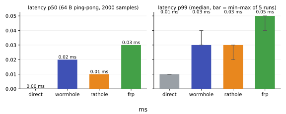
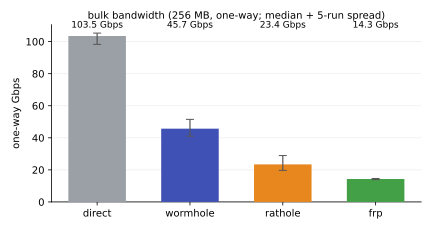
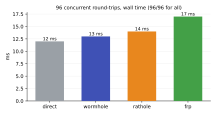

# wormhole

A fast, minimal, **stateless** TCP tunnel for NAT traversal, in Rust.

Like [frp](https://github.com/fatedier/frp) and [rathole](https://github.com/rathole-org/rathole), it exposes a service behind NAT on a public server. The difference: the server is stateless — it holds no service list. The client declares its tunnels at connect time; the server binds the requested public ports on demand (gated by an allow/forbid policy) and tears them down when the client goes away.

## Features

- **Stateless server** — one config serves any number of clients with any tunnels; tunnels change client-side only.
- **Fast** — zero-copy data path, a lone frame flushes immediately. ~44% of the bare loopback floor on bulk bandwidth; ~2× rathole, ~3.2× frp (defaults). See [Benchmark](#benchmark).
- **Multiplexed** — one control + N data channels (default 8) on a single data port; each connection pinned to its own channel, so a slow consumer stalls only itself.
- **Stable** — backpressure (bounded buffers), PING/PONG liveness, TCP keepalive on every channel, self-healing data channels (a flap costs latency, never data), whole-session auto-reconnect.
- **Simple** — one binary, two small TOML files, a shared secret; the server opens exactly two ports. No certificates, no tokens, no build-time system dependencies.

## Quickstart

Exposing SSH on a home machine:

**1. Public server** — generate a secret and run:

```bash
openssl rand -hex 32
```

```toml
# server.toml
[server]
bind = "0.0.0.0:1400"
secret = "the_shared_secret"
# data_port = 1401     # optional; default: control port + 1
```

```bash
wormhole serve server.toml
```

**2. Behind the NAT** — run the client:

```toml
# client.toml
[client]
server = "myserver.com:1400"
secret = "the_shared_secret"
# channels = 8         # optional; the data port is learned from the server

[services.ssh]
remote = 2222          # public port the server binds
local  = "127.0.0.1:22"
```

```bash
wormhole client -c client.toml
```

**3. Use it.** Traffic to `myserver.com:2222` now reaches `127.0.0.1:22` on the client:

```bash
ssh -p 2222 user@myserver.com
```

`[services.*]` entries are the tunnels — add as many as you like.

Validate both configs before going live (either file order; exits non-zero on any mismatch):

```bash
wormhole check client.toml server.toml
```

## Configuration

Comments are the manual:

```toml
[server]
bind = "0.0.0.0:1400"     # required — control listener
secret = "…"              # required — shared secret
#data_port = 1401         # optional — the one port all data channels attach
                          # to (default: control + 1; learned by the client
                          # at connect, never set in the client config)
allow_ports = [2222, "1402-1403"]   # optional whitelist of public ports
#forbid_ports = [25, 53, 3389]      # optional blacklist; a port must pass both

[client]
server = "myserver.com:1400"  # required — the control address
secret = "…"                  # required — must equal the server's
#channels = 8                 # optional — parallel data channels, 1..64

[services.ssh]
remote = 2222                # required — public port(s) the server binds
local  = "127.0.0.1:22"      # optional — what the client dials
                             # (default: the remote port on 127.0.0.1)

[services.rng]
remote = "1402-1403"         # ranges map positionally
local  = ["127.0.0.1:1402", "10.0.0.5:1403"]
```

`remote`/`local` accept a port, an `"A-B"` range, or a list of either; `local` also accepts `host:port` entries (a bare port means `127.0.0.1`). Omit `local` entirely and each remote port maps to itself on `127.0.0.1`. A denied proxy is reported in `PROXYACK`; the session continues with the rest.

## CLI

| command | description |
|---|---|
| `wormhole check FILE [OTHER]` | validate a config; with a second file (one `[server]` + one `[client]`) validate both and report on the complete setup |
| `wormhole serve FILE` | run the server |
| `wormhole client [-c FILE]` | run the client; reconnects automatically |
| `wormhole version` | print the version |

No file given: falls back to `./server.toml` / `./client.toml` / `./wormhole.toml`. Log level follows `RUST_LOG` (default `info`).

## Benchmark

Loopback, local echo backend, stock configurations, 5 runs each:







Median bulk bandwidth: **45.7 Gbps** vs rathole 23.4 and frp 14.3 (direct floor ~103.5). Caveat: loopback is the CPU-bound case; on a bandwidth-limited link every tunnel ties at the link ceiling — the win there is stability and low overhead, not raw speed. Methodology and raw data: [docs/benchmark.md](docs/benchmark.md).

## Security

- The shared secret authenticates every channel (control + each data connection) by its SHA-256; the raw secret never crosses the wire.
- **Payloads are not encrypted.** If the link is untrusted, terminate TLS in front of the public ports.
- `allow_ports`/`forbid_ports` is enforced server-side; a client can only expose what the server permits.

## Building

```bash
cargo build --release      # -> target/release/wormhole
cargo test --release       # 31 tests incl. the lossless channel-flap test
cargo clippy --all-targets
```

Edition 2024, MSRV 1.96. Wire format and lifecycle: [docs/protocol.md](docs/protocol.md).

## License

MIT — see [LICENSE](LICENSE).
