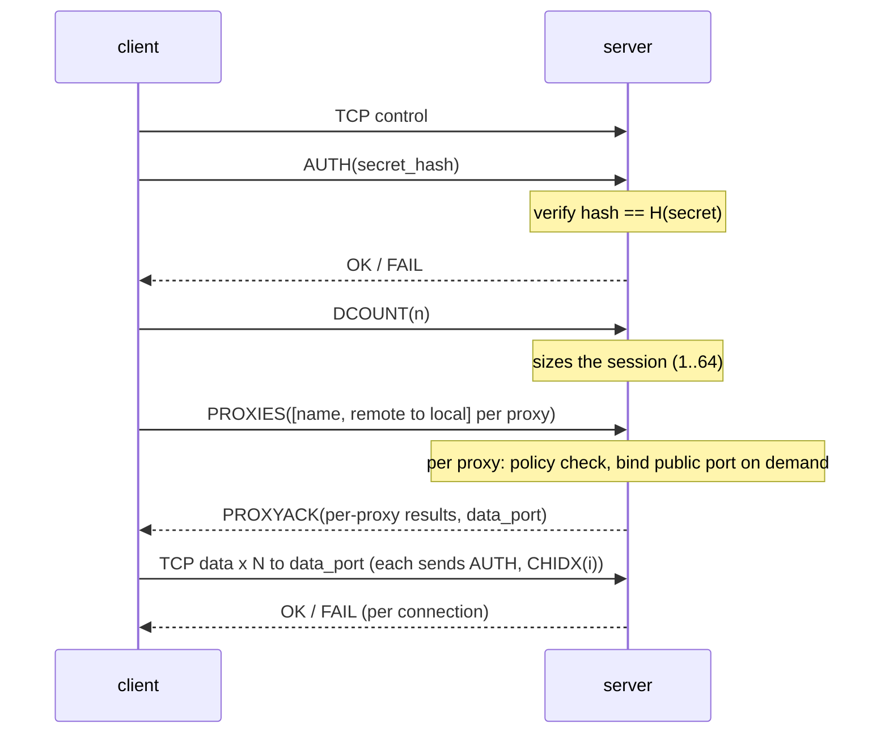
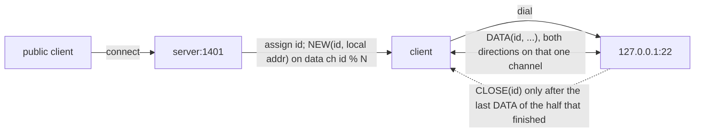

# Protocol

Wire format and lifecycle. Version: v4.

## Topology

```
internet ──► server ──(1 control + N data TCP, secret-authed)──► client ──► 127.0.0.1:local
```

- **Control channel** — one TCP connection on the control port. Signalling only (auth, proxy registration, heartbeat); never carries payload.
- **Data channels** — N TCP connections (client-chosen, default 8) on ONE shared data port, carrying all payload. Each authenticates (`AUTH`) then names its index (`CHIDX`). Connection `id` is pinned to channel `id % N`, so its `NEW`/`DATA`/`CLOSE` share one stream.

Two ports are ever opened: control + data (default control + 1). The server advertises the data port in `PROXYACK`; the client config never states it. The two configs share nothing but the secret.

## Frames

```
[type:u8][len:u16 BE][payload: len bytes]
```

Payload ≤ 65 533 bytes (`MAX_PAYLOAD = u16::MAX - 2`). The decoder bounds-checks; a malformed or unknown frame drops the channel it arrived on — never a panic.

| type | name | dir | payload |
|---|---|---|---|
| 0x01 | `AUTH` | c→s | `secret_hash: [u8; 32]` |
| 0x02 | `OK` | s→c | — (auth accepted; data-channel slot taken) |
| 0x03 | `FAIL` | s→c | — (auth rejected; data-channel rejected) |
| 0x04 | `DCOUNT` | c→s | `n: u8` (number of data channels the client will open) |
| 0x05 | `NEW` | s→c | `id: u16`, `local_host_len: u8`, `local_host`, `local_port: u16` |
| 0x06 | `CLOSE` | either | `id: u16` |
| 0x07 | `DATA` | either | `id: u16`, `bytes…` (≤ 65 533) |
| 0x08 | `PROXIES` | c→s | `count: u16`, then per entry: `name_len: u8`, `name`, `remote: u16`, `local_host_len: u8`, `local_host`, `local_port: u16` |
| 0x09 | `PING` | either | `nonce: u32` |
| 0x0a | `PONG` | either | `nonce: u32` (echo) |
| 0x0b | `CHIDX` | c→s | `i: u8` (which data channel this connection is; sent right after `AUTH`) |
| 0x0c | `PROXYACK` | s→c | per proxy (same order as `PROXIES`): `name_len: u8`, `name`, `status: u8`; then `data_port: u16` |

`PROXYACK` status: `0` = bound, `1` = denied by the port policy, `2` = duplicate port / bind failed. Zero proxies is valid (payload = the 2-byte `data_port`). All 12 type slots 0x01–0x0c are in use.

## Session lifecycle




- The server holds no service list: it binds each requested port on registration and closes all of them on client disconnect.
- A denied `remote` port is reported per-proxy in `PROXYACK`; the session continues.
- A data connection gets `OK` when its index is < n and free; `FAIL` (and close) otherwise. The client retries.

## Data path




`NEW` carries the concrete local address to dial. `NEW`/`DATA`/`CLOSE` for one id share a channel and a reader, so registration precedes the first byte and close follows the last.

## Flow control

- Each direction of each connection is a task with a bounded mpsc buffer (64 frames); a slow consumer stalls only its own connection.
- The channel writer coalesces up to 256 KiB of frames into one segment, but a lone frame writes immediately.
- The server caps live connections at 16 384 per session; beyond that, new connections are dropped with a log line.

## Liveness

- Both ends send `PING` every 15 s and expect `PONG`; a session dies after 45 s of silence.
- Every channel uses TCP keepalive (idle 30 s, then 10 s probes × 3): a half-open (no-RST) dead peer is reaped in ~60 s instead of hours.
- **Channel re-attach** — a slot is "free or attached" and its frame queue survives flaps: a dead data channel re-opens by itself (backoff + jitter) and re-attaches at the same index; queued bytes are delivered on re-attach. A flap costs latency, never data.
- **Session reconnect** — if the control channel dies, the client reconnects the whole session (backoff + jitter), re-authenticates, and re-registers all proxies.
